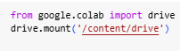
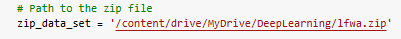
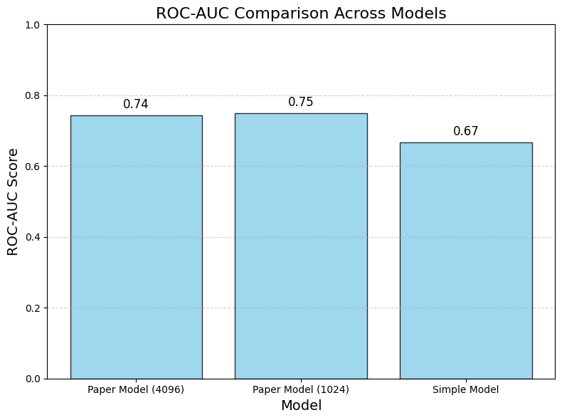
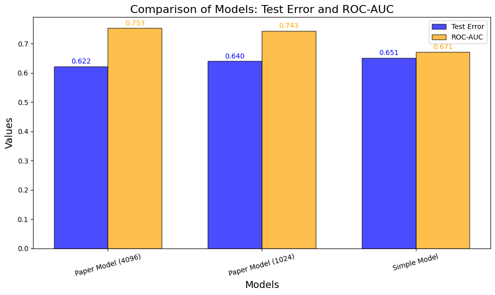
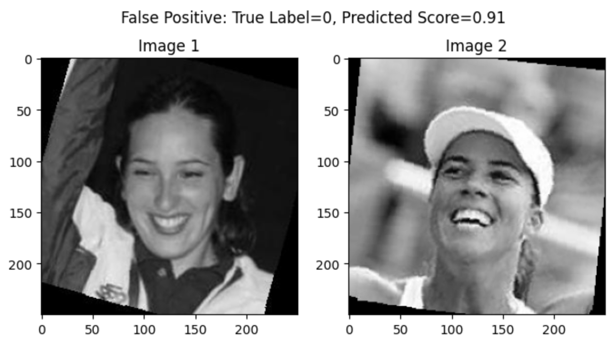
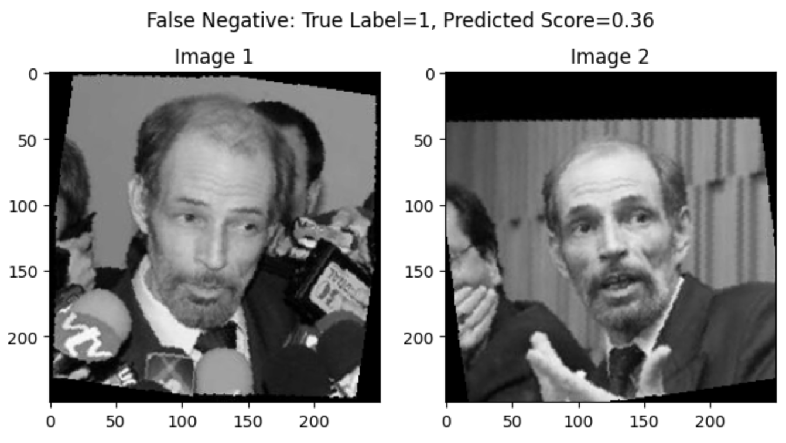
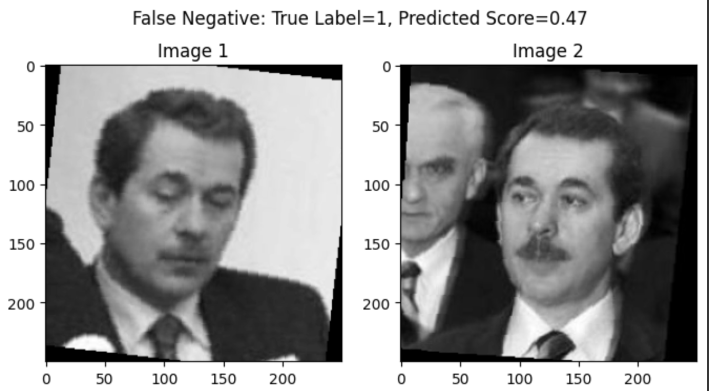
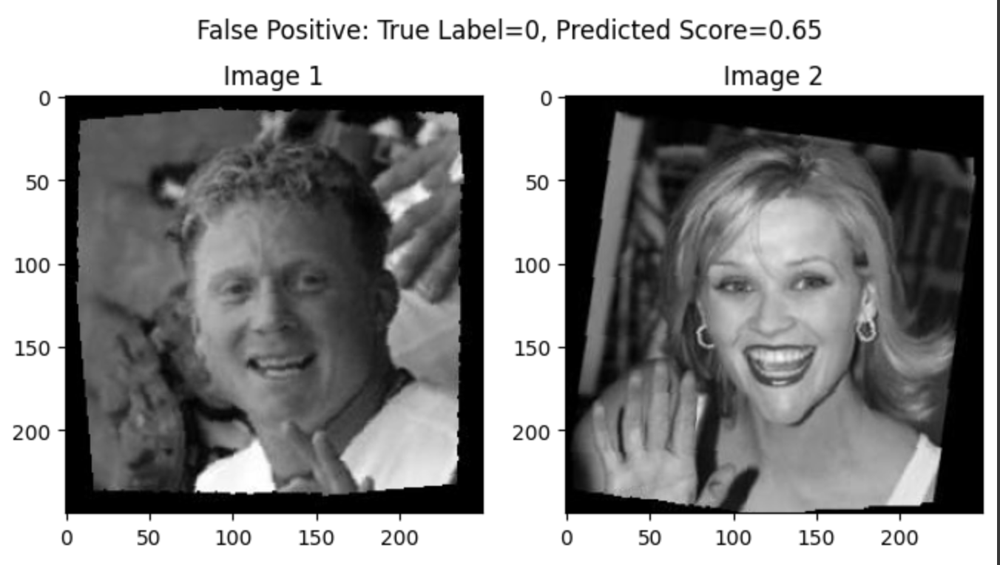

> Eyal Ben Barouch - 318651494 Alon Fridental - 209370774
>
> **<u>Deep Learning Assignment 2 Report</u>**
>
> [**<u>Siamese Neural Networks for One-shot Image
> Recognition</u>**](https://www.cs.cmu.edu/~rsalakhu/papers/oneshot1.pdf)
>
> **Introduction**
>
> In this project, we implemented a Siamese network architecture
> inspired by the paper *"Siamese* *Neural* *Networks* *for* *One-shot*
> *Image* *Recognition"* to solve the task of verifying whether two
> faces are identical or not. The network uses two identical branches to
> extract features from the image pairs, compares them using the L1
> distance, and predicts if they match. Along the way, we learned a lot
> about designing deep learning architectures, trying out different
> configurations, and understanding how things like data augmentation,
> regularization, and hyperparameters affect the results. It was a
> hands-on experience that taught us a lot about what works and what
> doesn’t when training a model like this.
>
> **<u>Data Analysis - LFW - a</u>**
>
> **<u>Train Dataset Statistics:</u>**
>
> Total Examples: 2200
>
> Positive Pairs: 1100
>
> Negative Pairs: 1100
>
> **Test** **Dataset** **Statistics:**
>
> Total Examples: 1000
>
> Positive Pairs: 500
>
> Negative Pairs: 500
>
> Image size: (250, 250)
>
> Image mode: Gray Sclae
>
> Eyal Ben Barouch - 318651494 Alon Fridental -
> 209370774 style="width:2.10417in;height:0.60417in" /> style="width:4.17708in;height:0.40625in" />
>
> **Data** **loading**
>
> **●** Mount your drive.
>
> **●** Save the zip file in my drive inside the folder names
>
> "DeepLearning".
>
> **●** Unzip it and allocate the complete dataset, train and test in
>
> accordense
>
> **o** Create a folder "lfw2".
>
> o Create a sub-folder called ‘lfw2’ inside ‘lfwa’ and copy all images
>
> there.
>
> o Create sub folder "train" and "test" and allocate accordingly to the
>
> train and test given, for example :
> "/content/lfw2/test/AJ_Lamas/AJ_Lamas_0001.jpg ".
>
> Eyal Ben Barouch - 318651494 Alon Fridental - 209370774
>
> **<u>Data Preprocessing</u>**
>
> To enhance the robustness of the model and ensure consistency in input
> size and format, the following preprocessing steps were applied to all
> images:
>
> ● Resizing: All images were resized to a uniform dimension of 250x250
>
> pixels. (Same as input) ● Data Augmentation:
>
> ○ Random Horizontal Flip: To introduce variability and simulate
> real-world conditions, images were flipped horizontally with a random
> probability.
>
> ○ Random Rotation: Images were randomly rotated within a range of ±10
> degrees to account for slight orientation differences in real-world
> images.
>
> ● Normalization:
>
> ○ Images were normalized to have a mean of 0.5 and a standard
> deviation of 0.5 for each channel to standardize pixel intensity
> values.
>
> **<u>Initialization:</u>**
>
> While the paper suggests initializing weights with a normal
> distribution (mean=0, std=0.01), we found better results using Kaiming
> He initialization for convolutional layers (optimized for ReLU
> activations), Xavier Glorot initialization for fully connected layers
> (balanced for symmetric activations like Sigmoid), and initializing
> batch normalization layers with weights of 1.0 and biases of 0.0. This
> approach improved convergence, stabilized training, and maintained
> gradient flow, leading to significantly better performance in our
> tests.
>
> Eyal Ben Barouch - 318651494 Alon Fridental - 209370774
>
> <u>**HyperParameters**:</u>
>
> We Used GridSearch to evaluate different hyperparameters and these
> showed the best results:
>
> ● **Validation** **Split**: 20% of the training data was used for
> validation.
>
> ● **Batch** **Size**: 64
>
> ● **Learning** **Rate**: 0.01
>
> ● **Momentum**: 0.9 (used for the SGD optimizer to accelerate
> convergence
>
> and stabilize updates)
>
> ● **Weight** **Decay**: 0.001 (L2 regularization to prevent
> overfitting) ● **Max** **Epochs**: 50
>
> ● **Early** **Stopping** **Patience**: 20 (training stops if
> validation performance does not improve for 20 consecutive epochs)
>
> ● **Seed**: 42 (for reproducibility of results)
>
> Eyal Ben Barouch - 318651494 Alon Fridental - 209370774
>
> **<u>Model Architecture:</u>**
>
> <u>We experimented with two different architectures:</u>
>
> **1.** **Architecture** **Based** **on** **the** **Paper:** ○ Input
> size: 250x250
>
> ○ Detailed layer configuration:

||
||
||
||
||
||
||
||

> This network represents the branch that processes each image pair
> independently before the final layer, where the L2 distance between
> their feature embeddings is computed to classify whether the images
> depict the same person or not. Another Approach we tried was to
> decrease the final output size from 4096 to 1024 , This didn’t lead to
> significantly better performance on the test set.
>
> Eyal Ben Barouch - 318651494 Alon Fridental - 209370774
>
> <u>2. **Simplified Architecture:**</u>
>
> After training our paper-based network, we observed that it overfitted
> quickly, leading us to believe that the architecture was too complex
> for the task. To address this, we designed a simpler network to
> experiment and determine if a less complex model would perform better.

||
||
||
||
||
||
||

> We designed the simplified architecture to address the overfitting
> observed in the paper-based network, which we believed was too complex
> for the dataset. By reducing the number of filters, using smaller
> kernels (5x5, 3x3), and lowering the fully connected layer size from
> 4096 to 1024, we significantly reduced the number of parameters. This
> simpler design focuses on extracting essential features while
> minimizing the risk of overfitting. Dropout (0.3) and batch
> normalization were added to further improve generalization, making the
> model more suitable for the limited dataset size.
>
> Eyal Ben Barouch - 318651494 Alon Fridental -
> 209370774 style="width:5.77083in;height:4.30208in" />
>
> **<u>Experiments Comparison:</u>** **<u>Max Epochs - 15</u>**
>
>  style="width:6.34375in;height:3.78125in" />**<u>Max Epochs - 50:</u>**
>
> Eyal Ben Barouch - 318651494 Alon Fridental -
> 209370774 style="width:3.23958in;height:1.79167in" /> style="width:3.20833in;height:1.80208in" />
>
> **<u>Error Analysis</u>**
>
> **<u>Paper Model:</u>**
>
> As we can see, the Paper model made some acceptable errors, such as
> misclassifications where even a human might struggle (e.g., a score of
> 0.91). It also faced challenges in recognizing similarities between
> images of the same person taken from different angles, which is a
> common limitation of convolutional neural networks (CNNs).
>
> Eyal Ben Barouch - 318651494 Alon Fridental -
> 209370774 style="width:3.60417in;height:1.98958in" /> style="width:3.63542in;height:2.05208in" />
>
> **<u>Simple Model:</u>**
>
> The simplified model, while reducing overfitting, made some more
> severe misclassifications, likely due to its inability to capture
> essential details in the images, as it lacked the complexity needed to
> identify subtle yet critical features.
>
> Eyal Ben Barouch - 318651494 Alon Fridental - 209370774
>
> **<u>Conclusion</u>**
>
> From our experiments, the Paper Model (4096) performed better overall
> in terms of ROC-AUC and test error, effectively capturing essential
> features in the data. However, it suffered from significant
> overfitting due to its complexity and large number of parameters. The
> Simplified Model was designed to reduce overfitting by lowering
> complexity, but, to our surprise, it also exhibited overfitting,
> likely due to insufficient capacity to .generalize across the dataset
>
> Key lessons learned include the importance of balancing model
> complexity with the dataset size and exploring additional strategies
> to address overfitting, such as stronger regularization, further data
> augmentation, or modifying the training process. Future research
> should investigate intermediate architectures, pretrained models, or
> advanced techniques like attention mechanisms to improve performance
> and .generalization
